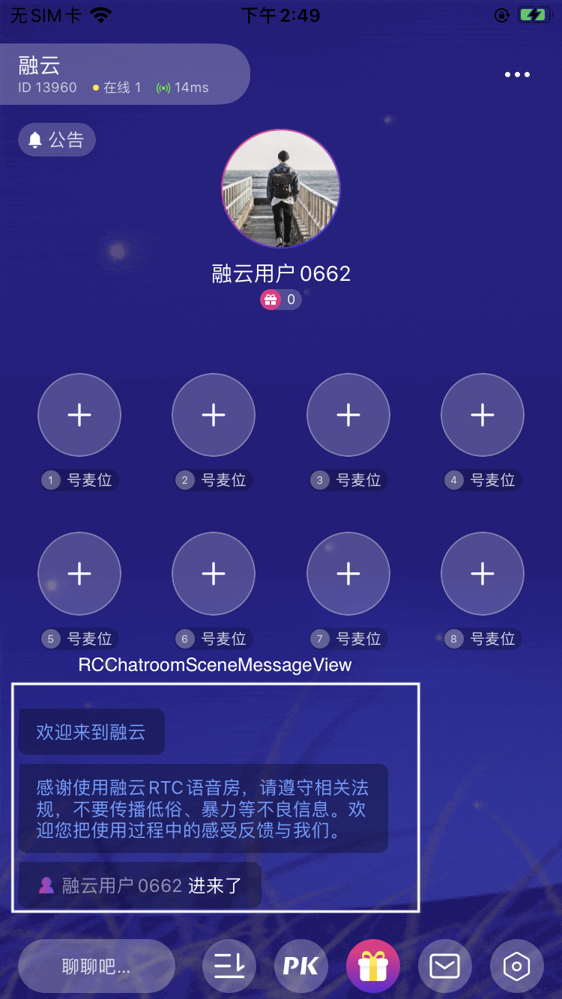
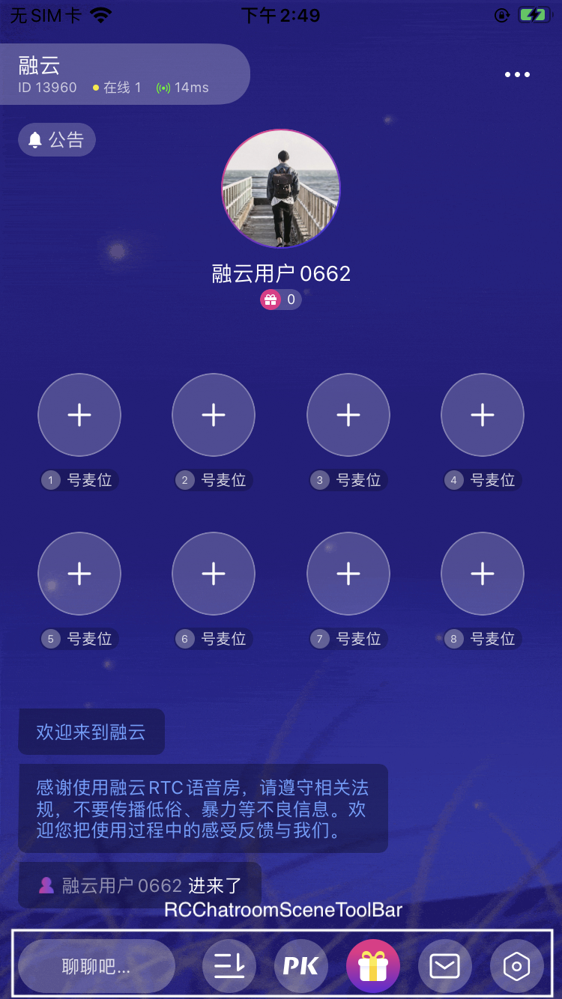
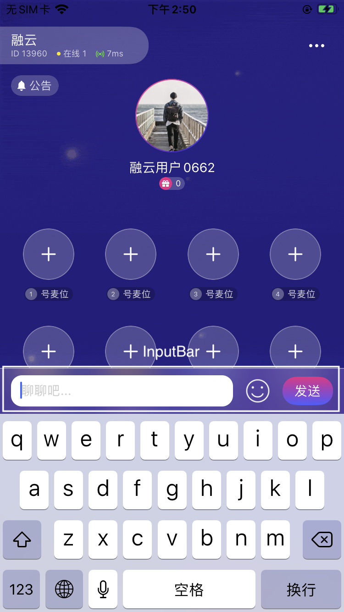

# iOS RCChatRoomSceneKit 文档

## 简介
语聊房/视频直播房间场景 Kit，封装了消息列表、底部工具栏、输入框等常见的UI组件，并且可以通过json配置文件远端加载或者本地修改UI属性值。

## 集成
#### 使用 CocoaPods
1. cd 至项目根目录
2. 执行 pod init
3. 执行 open -e Podfile
4. 添加导入配置 pod 'RCChatroomSceneKit', '~> 0.0.1’ ，此处以集成 1.0.0 版本为例
5. 执行 pod install
6. 双击打开 .xcworkspace

## 包含组件说明
`RCChatRoomSceneKit ` 内部包含两个自定义组件：
- RCChatroomSceneMessageView消息列表view:


- RCChatroomSceneToolBar 底部功能栏view:


其中, RCChatroomSceneToolBar左边唤起输入按钮触发弹出InputBar


## 可配置项说明
`CoreKit` 基础库中RCCoreKitBundle 里面的`KitConfig.json` 文件，配置了所有的子Kit（RCChatRoomSceneKit，MusicControlKit等）的UI组件属性，**当前的RCChatRoomSceneKit相关的属性配置以及描述如下：**

```
{
  // 集成 RCChatRoomSceneKit
  "ChatRoomKit": {
    // 消息列表的配置
    "MessageView": {
      // 消息列表距离四周的距离
      "contentInsets": {
        "top": 0,
        "bottom": 0,
        "left": 0,
        "right": 0
      },
      // 最大显示的消息数量，超过最大数量移除顶部消息
      "maxVisibleCount": 50,
      // 消息气泡的默认颜色，优先级低于自定义
      "defaultBubbleColor": {
        "red": 0,
        "green": 0,
        "blue": 0,
        "alpha": 0.3
      },
      // 消息气泡内部边距
      "bubbleInsets": {
        "top": 7,
        "bottom": 7,
        "left": 12,
        "right": 12
      },
      // 消息气泡的默认圆角，优先级低于自定义
      "defaultBubbleCorner": {
        "radius": 10,
        "leftTop": 0,
        "rightTop": 0,
        "rightBottom": 0,
        "leftBottom": 0,
      },
      // 消息气泡的默认文字颜色，优先级低于自定义
      "defaultBubbleTextColor": {
        "red": 255,
        "green": 255,
        "blue": 255,
        "alpha": 0.7
      },
      // 消息气泡的上下间距
      "bubbleSpace": 5,
      // 语音消息图标及时长文字的颜色
      "voiceIconColor": {
        "red": 255,
        "green": 255,
        "blue": 255,
        "alpha": 1
      }
    },
    // 底部工具栏
    "ToolBar": {
      // 工具栏背景颜色
      "backgroundColor": {
        "red": 0,
        "green": 0,
        "blue": 0,
        "alpha": 0
      },
      // 工具栏内边距
      "contentInsets": {
        "top": 0,
        "bottom": 0,
        "left": 0,
        "right": 0
      },
      // 输入框按钮文字
      "chatButtonTitle": "聊聊吧...",
      // 输入框按钮大小
      "chatButtonSize": {
        "width": 105,
        "height": 36
      },
      // 输入框按钮内边距
      "chatButtonInsets": {
        "top": 0,
        "bottom": 0,
        "left": 0,
        "right": 0
      },
      // 输入框按钮文字颜色
      "chatButtonTextColor": {
        "red": 255,
        "green": 255,
        "blue": 255,
        "alpha": 1
      },
      // 输入框按钮文字颜色
      "chatButtonTextSize": 12,
      // 输入框按钮背景色
      "chatButtonBackgroundColor": {
        "red": 255,
        "green": 255,
        "blue": 255,
        "alpha": 0.26
      },
      // 输入框按钮背景圆角
      "chatButtonBackgroundCorner": 18,
      // 录音按钮是否可用
      "recordButtonEnable": true,
      // 录音质量
      "recordQuality": 0,
      // 录音按钮位置，0，左，1右
      "recordPosition": 0,
      // 录音最大时长
      "recordMaxDuration": 60,
      // 底部按钮集合
      "buttonArray": [
        {
          // 按钮网络图片
          "icon": "url1",
          // 是否有右上角的气泡提示
          "hasBadge": true
        },
        {
          "icon": "url2",
          "hasBadge": false
        }
      ]
    },
    // 输入框view
    "InputBar": {
      // InputBar 背景色
      "backgroundColor": {
        "red": 86,
        "green": 68,
        "blue": 168,
        "alpha": 1
      },
      // InputBar 内边距
      "contentInsets": {
        "top": 7,
        "bottom": 7,
        "left": 12,
        "right": 12
      },
      // 输入框背景色
      "inputBackgroundColor": {
        "red": 255,
        "green": 255,
        "blue": 255,
        "alpha": 1
      },
      // 输入框圆角
      "inputCorner": 8,
      // 输入最大文字长度
      "inputTextMaxLength": 1000,
      // 输入框最小高度
      "inputMinHeight": 36,
      // 输入框最大高度，输入文字多行时的最大高度
      "inputMaxHeight": 108,
      // 输入框内文字大小
      "inputTextSize": 14,
      // 输入框内文字颜色
      "inputTextColor": {
        "red": 51,
        "green": 51,
        "blue": 51,
        "alpha": 1
      },
      // 输入框内默认提示文字
      "inputHint": "聊聊吧...",
      // 输入框内默认提示文字颜色
      "inputHintColor": {
        "red": 153,
        "green": 153,
        "blue": 153,
        "alpha": 1
      },
      // 输入框内边距
      "inputInsets": {
        "left": 10,
        "top": 5,
        "right": 10,
        "bottom": 5
      },
      // 是否开启emoji输入功能
      "emojiEnable": true
    }
  }
}
```

## 使用
#### RCChatroomSceneMessageView
1. 创建

```swift
var chatroomView = RCChatroomSceneView()

/// 对外提供的是一个RCChatroomSceneView，内部持有messageView ，类型是RCChatroomSceneMessageView
var messageView = chatroomView.messageView

///设置消息点击事件代理
messageView.setEventDelegate(self)

/// layout
viewOfYourProject.addSubview(messageView)
chatroomView.messageView.snp.makeConstraints { make in
          ///.....
}
```

2. 添加文本消息到列表

```
///上面创建的messageView对象调用：
messageView.addMessage(msg)

/// addMessage是Objective-C接口定义：
- (void)addMessage:(id<RCChatroomSceneMessageProtocol>)message;

///消息对象msg要遵守RCChatroomSceneMessageProtocol协议：
@protocol RCChatroomSceneMessageProtocol <NSObject>
@optional

/// 气泡颜色
- (UIColor *)bubbleColor;
/// 返回气泡文字颜色，返回 null 采用默认配置
- (UIColor *)bubbleTextColor;
/// 返回气泡文字颜色，返回 null 采用默认配置
- (RCConner *)bubbleCorner;
 
/// 点击事件，eventRange:eventId
/// eventRange：标记事件在 attributeString 中的位置
/// eventId：事件标记，比如：用户 ID、礼物 ID 等
- (NSDictionary<NSValue *, NSString *> *)events;

/// 富文本消息体
- (NSAttributedString *)attributeString;
@end
```


3. 添加语音消息到列表:
```
///上面创建的messageView对象调用：
messageView.addMessage(msg)

///这里的语音消息对象msg要遵守RCChatroomSceneVoiceMessage协议,
@protocol RCChatroomSceneVoiceMessage <RCChatroomSceneMessageProtocol>
/// 语音文件本地路径
- (NSString *)voicePath;

/// 语音时长
- (long)voiceDuration;
@end
```

**RCChatroomSceneVoiceMessage遵守RCChatroomSceneMessageProtocol
因此构建消息对象msg同时也继承了RCChatroomSceneMessageProtocol里面的属性，
也需要去实现协议里对应的方法，返回相关的属性值。**

4. 得到消息体点击回调，获取对应的信息
```
/// 第1步（创建）里面设定的事件代理对象：
messageView.setEventDelegate(self)

setEventDelegate是Objective-C接口定义：
- (void)setEventDelegate:(id<RCChatroomSceneEventProtocol>)trackDelegate;

///这里的语音消息对象self要遵守RCChatroomSceneEventProtocol协议：
@protocol RCChatroomSceneEventProtocol <NSObject>
///得到消息bubble内容点击的回调，以及消息bubble所对应的UITableViewCell
- (void)cell:(UITableViewCell *)cell didClickEvent:(NSString *)eventId;
@end
```


#### RCChatroomSceneToolBar
1. 创建

```swift
///同样创建RCChatroomSceneMessageView机理一样，RCChatroomSceneView内部持有RCChatroomSceneToolBar：
var chatroomView = RCChatroomSceneView()
var toolBar = chatroomView.toolBar

///设置代理对象
toolBar.delegate = self

/// layout
viewOfYourProject.addSubview(toolBar)
toolBar.snp.makeConstraints { make in
          ///.....
}
```

 
2. 配置 ToolBar按钮
`RCChatroomSceneToolBar ` 横向包含三个部分：
- 左边唤起输入按钮
- 中间的按钮排列组(属性命名为commonActions)
- 右边的按钮排列组(属性命名为actions)

```
let button1 = YourDefinedUIButon（）
let button2 = YourDefinedUIButon（）
let button3 = YourDefinedUIButon（）
let button4 = YourDefinedUIButon（）

let config = RCChatroomSceneToolBarConfig.default()
/// 最左边唤起输入按钮，是否显示语音输入按钮
config.recordButtonEnable = true

///中间按钮排列组
config.commonActions = [button1, button2]

///右边的按钮排列组
config.actions = [button3, button4]
chatroomView.toolBar.setConfig(config)
```
**上面配置代码生效后，左边的输入唤起按钮会显示语音输入按钮，button1, button2从左到右依次构成中间排列组，button3, button4 从左到右依次构成右边排列组**

3. ToolBar发送文字代理回调

```
/// 文本输入点击发送后调用
/// @param text 文本内容
- (void)textInputViewSendText:(NSString *)text;
```

4. ToolBar 语音输入相关事件代理回调

```
/// 判断是否能开启录音,交给代理对象做决策，以及额外的逻辑处理
- (BOOL)audioRecordShouldBegin;
/// 开始录音
- (void)audioRecordDidBegin;
/// 取消录音
- (void)audioRecordDidCancel;
/// 录音完成
/// @param NSData 音频文件
/// @param time 音频文件时长，单位：秒
- (void)audioRecordDidEnd:(nullable NSData *)data time:(NSTimeInterval)time;
```

## 其他
如有任何疑问请提交issue
